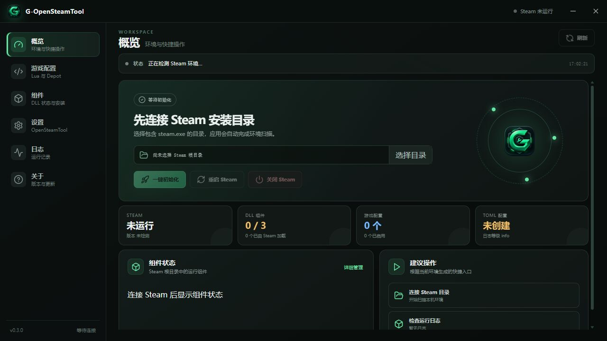

# G-OpenSteamTool

[](https://github.com/G-Yoka/G-OpenSteamTool/releases/latest)
[](https://github.com/G-Yoka/G-OpenSteamTool/releases)

🌐 语言 / Language：**简体中文** · [English](docs/README.en.md)

G-OpenSteamTool 是面向 Windows 的 OpenSteamTool 桌面管理器，用一个直观的工作区管理 Steam 目录、运行组件、游戏 Lua、Depot 信息、TOML 设置和运行日志。

- 当前版本：`v0.3.1`
- 运行环境：Windows 10/11 x64
- 技术栈：Tauri 2 / Rust / React / TypeScript
- 更新方式：从 [GitHub Releases](https://github.com/G-Yoka/G-OpenSteamTool/releases) 手动下载

> 本项目只提供桌面管理器和资源管理能力，不编译 OpenSteamTool 上游源码，也不会绕过 Steam 授权获取当前账户本地不存在的 Depot Key。

## 界面预览



## 功能

- 自动检测 Steam 安装目录，也可手动选择包含 `steam.exe` 的目录，并在下次启动时自动恢复。
- 扫描、安装和安全移除 `OpenSteamTool.dll`、`dwmapi.dll`、`xinput1_4.dll`。
- 使用 SHA-256 区分托管 DLL、外部 DLL、缺失文件和已加载状态，避免误删用户文件。
- 创建和编辑 Steam 根目录下的 `opensteamtool.toml`。
- 按 `G-<AppId>.lua` 管理游戏配置，支持启用、禁用、导入与删除。
- 从本地 `appcache/appinfo.vdf` 自动读取 App 名称、Depot ID 和 Public Manifest GID。
- 从本地 `config/config.vdf` 合并当前 Steam 环境已有的 Depot Key。
- 本地自动获取会同时补充当前游戏 App ID，生成不带 Key 的 `addappid(<AppId>)` 条目。
- 读取并筛选 `<Steam>/opensteamtool/*.log` 日志。
- 在后台线程安全关闭或重启 Steam，避免界面阻塞和重复启动。
- 纯手动发布更新，不包含应用内更新、GitHub 网络优化或 DNS 优化功能。

## 下载与安装

前往 [Releases](https://github.com/G-Yoka/G-OpenSteamTool/releases/latest) 下载：

- `g-opensteamtool.exe`：完整便携版，无需安装，DLL 资源已内嵌。
- `SHA256SUMS.txt`：用于核验下载文件完整性。

GitHub 自动生成的 `Source code (zip)` / `Source code (tar.gz)` 是源码，不是可直接运行的程序。完整安装与升级说明见 [docs/INSTALL.md](docs/INSTALL.md)。

## 快速使用

1. 完全退出 Steam 后启动 G-OpenSteamTool。
2. 确认自动检测到的 Steam 目录，或手动选择包含 `steam.exe` 的根目录。
3. 点击“一键初始化”，安装托管 DLL 并创建默认 TOML。
4. 打开“游戏配置”，输入 App ID 后点击“本地自动获取”。
5. 核对自动发现的 Depot、Key 和 Manifest，保存为 `G-<AppId>.lua`。
6. 重启 Steam，使 DLL、TOML 和 Lua 配置生效。

## Depot 本地发现

Steam 的两个本地文件承担不同职责：

```text
<Steam>/appcache/appinfo.vdf   App ID → App 名称 / Depot ID / Public Manifest
<Steam>/config/config.vdf     Depot ID → DecryptionKey
```

G-OpenSteamTool 按 Depot ID 合并两者。没有显示 Key 通常表示当前 Steam 本地配置尚未保存该 Depot 的 Key；应用不会生成、猜测或联网绕过授权获取 Key。

## 安全边界

- DLL 移除只处理由本工具安装且哈希匹配的文件。
- Lua 管理只操作 `G-*.lua` 与 `G-*.lua.disabled`，不主动改写普通 Lua。
- TOML、Lua 和安装清单采用临时文件与回滚写入，降低中途失败造成文件损坏的风险。
- Depot Key 仅在本地读取和写入用户选择的配置，不写入应用日志。
- 当前版本不包含应用内更新、GitHub Release 查询、DoT 或 DNS 优化代码。

## 从源码构建

需要 Node.js、Rust MSVC 工具链和 Visual Studio Build Tools（Desktop development with C++）。

```powershell
cd app
npm ci
npm run build
cargo test --manifest-path src-tauri/Cargo.toml
npm run build:tauri-release
```

构建产物位于：

```text
app/src-tauri/target/release/g-opensteamtool.exe
```

## 仓库结构

```text
G-OpenSteamTool/
├── app/
│   ├── src/                     React / TypeScript 前端
│   ├── src-tauri/
│   │   ├── src/                 Rust 后端与 services 分层
│   │   ├── tests/               Rust 集成测试
│   │   ├── resources/dlls/      编译进 EXE 的 DLL 资源
│   │   └── icons/               应用图标资源
│   ├── package.json
│   └── vite.config.ts
├── docs/
│   ├── README.md                文档索引
│   ├── README.en.md             English documentation
│   ├── INSTALL.md               安装与升级说明
│   ├── CHANGELOG.md             版本变更记录
│   └── releases/                各版本发布说明
├── screenshots/
├── README.md
└── .gitignore
```

## 文档

- [安装、升级与卸载](docs/INSTALL.md)
- [版本变更记录](docs/CHANGELOG.md)
- [v0.3.1 发布说明](docs/releases/v0.3.1.md)
- [v0.3.0 发布说明](docs/releases/v0.3.0.md)
- [English README](docs/README.en.md)

## 说明

G-OpenSteamTool 是非官方社区项目，与 Valve、Steam 或 OpenSteamTool 上游作者不存在隶属关系。使用前请确认符合所在地区法律、Steam 协议及相关软件许可；用户对自己的配置和使用结果负责。
